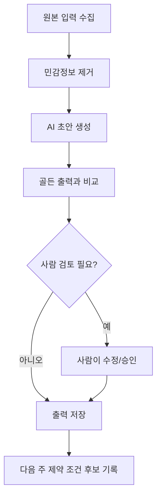

# 업무 순서도 템플릿 — workflow-map.md

> 목적: 내가 만들 자동화가 어디서 시작하고, 어떤 판단을 거쳐, 어디까지 사람에게 넘겨야 하는지 한눈에 보이게 만든다.
> 이 파일은 선택 실습입니다. 어렵게 그리지 말고 Mermaid 코드블록 하나만 완성하면 됩니다.

## 1. 한 줄 정의

- 업무명:
- 최종 산출물:
- AI가 맡을 일:
- 사람이 반드시 확인할 일:

## 2. 단계 목록

| 순서 | 단계 | 입력 | 처리 | 출력 | 담당 |
|---:|---|---|---|---|---|
| 1 | 원본 입력 받기 |  |  |  | 사람 |
| 2 | AI 초안 생성 |  |  |  | AI |
| 3 | 누락/오류 점검 |  |  |  | AI |
| 4 | 최종 판단 |  |  |  | 사람 |
| 5 | 외부 시스템 반영 |  |  |  | 사람 |

## 3. Mermaid 순서도



## 4. Claude Code / Codex에게 시킬 명령

```text
내 1주차 나침반과 golden/input-example.md, golden/output-example.md를 읽고
내 자동화 업무를 입력 → 처리 → 출력 → 사람 검토 흐름으로 나눠줘.

아래 파일로 저장해줘:
- outputs/workflow-map.md

반드시 포함할 것:
1. 한 줄 정의
2. 단계 표
3. Mermaid flowchart
4. AI가 하면 안 되는 단계
5. 3주차 제약 조건 후보 3개
```

## 5. 주의

- 실제 고객 연락, 문자/카톡 발송, 결제, 환불, 로그인, 정부/ERP/CRM 직접 입력은 AI 실행 단계로 넣지 않습니다.
- 그 단계가 필요하면 `사람 검토/사람 실행`으로 표시합니다.
- Mermaid가 어렵다면 단계 표만 완성해도 됩니다.
